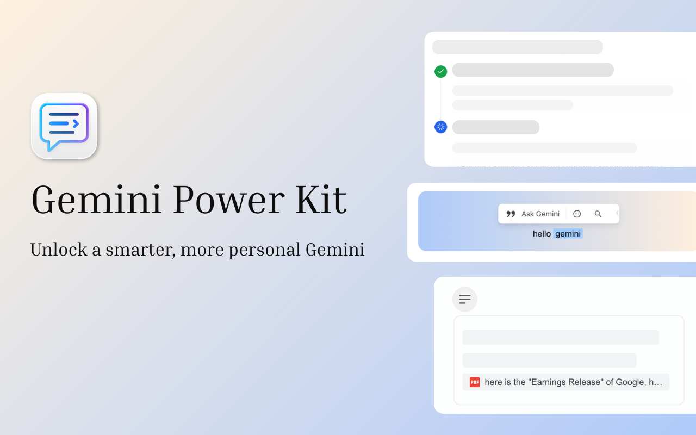

<p align="center">
  
</p>

<h1 align="center">Gemini Power Kit</h1>

<p align="center">
  An open-source browser extension that adds focused workflow and workspace tools to <a href="https://gemini.google.com">Gemini</a>.
</p>

<p align="center">
  <a href="https://gpk.ronktsang.com/">Website</a> ·
  <a href="https://gpk.ronktsang.com/guide/quick-start/">Quick start</a> ·
  <a href="https://gpk.ronktsang.com/features/">Feature guides</a> ·
  <a href="https://gpk.ronktsang.com/support/whats-new/">What's new</a> ·
  <a href="https://github.com/RonkTsang/gemini-chat-extension/issues">Issues</a>
</p>

<p align="center">
  <a href="LICENSE"></a>
</p>

## What it does

Gemini Power Kit helps you stay oriented in long conversations, turn repeated work into reusable flows, and shape Gemini around the way you work. It runs in your browser on `gemini.google.com`.

## Install

### Get it from a browser store

- **[Add to Chrome](https://chromewebstore.google.com/detail/ihakfpnmefdkllhkecanagmienfnmojn)**
- **[Get it for Firefox](https://addons.mozilla.org/en-US/firefox/addon/gemini-power-kit/)**

After installation, open [Gemini](https://gemini.google.com) and select the Gemini Power Kit icon near the bottom of the sidebar to open settings. The [quick start guide](https://gpk.ronktsang.com/guide/quick-start/) shows where to find it and how to enable optional features.

### From source

Use Node.js 22 and the version of pnpm pinned in `package.json`.

```bash
git clone https://github.com/RonkTsang/gemini-chat-extension.git
cd gemini-chat-extension
corepack enable
pnpm install
pnpm build
```

To load the Chromium build, open `chrome://extensions`, enable **Developer mode**, choose **Load unpacked**, and select `.output/chrome-mv3`.

For Firefox, build with `pnpm build:firefox`, then use Firefox's temporary-add-on workflow to load `.output/firefox-mv2`.

## Features

- **Work with conversations:** navigate long chats with [Chat Outline](https://gpk.ronktsang.com/features/chat-outline/), ask from selected text with [Quick Follow-up](https://gpk.ronktsang.com/features/quick-follow-up/), and automate repeatable multi-step tasks with [Chain Prompt](https://gpk.ronktsang.com/features/chain-prompt/).
- **Make the workspace yours:** adjust [themes and wallpaper](https://gpk.ronktsang.com/features/theme/), [chat layout](https://gpk.ronktsang.com/features/chat-layout/), and [Gem avatars](https://gpk.ronktsang.com/features/gem-avatar/).
- **Move through Gemini faster:** use configurable [keyboard shortcuts](https://gpk.ronktsang.com/features/shortcuts/), [bulk delete](https://gpk.ronktsang.com/features/bulk-delete/) with a review step, synced tab titles, and a direct “open in new tab” action for My stuff.
- **Stay informed:** optionally receive [reply-complete notifications](https://gpk.ronktsang.com/features/notifications/) while Gemini works in the background.

See the [feature overview](https://gpk.ronktsang.com/features/) for the full list and task-specific guides.

## Develop

| Task | Command |
| --- | --- |
| Start Chromium development mode | `pnpm dev` |
| Start Firefox development mode | `pnpm dev:firefox` |
| Type-check | `pnpm compile` |
| Run tests once | `pnpm test:run` |
| Check locale parity | `pnpm run check:i18n` |
| Build production bundles | `pnpm build` / `pnpm build:firefox` |

The extension is built with WXT, React, TypeScript, Chakra UI, and browser-local storage. Read [the technical documentation](docs/tech.md) and [platform differences](docs/platforms.md) before changing browser-specific behavior.

## Privacy and permissions

Gemini Power Kit processes feature data locally in your browser and does not operate a developer backend for Gemini conversations, prompts, responses, or settings. Some features request optional browser permissions only when they need them, such as reply-complete notifications. See the [Privacy Policy](PRIVACY_POLICY.md) for the complete, browser-specific explanation.

## Get help and contribute

- Read the [documentation site](https://gpk.ronktsang.com/) and [FAQ](https://gpk.ronktsang.com/support/faq/) for usage help.
- [Report a bug or suggest an improvement](https://github.com/RonkTsang/gemini-chat-extension/issues).
- Read [Contributing](CONTRIBUTING.md) before opening a pull request.
- Follow the [Code of Conduct](CODE_OF_CONDUCT.md) when participating in this project.
- Review [release notes](https://gpk.ronktsang.com/support/whats-new/) for user-facing changes.

## License

Gemini Power Kit is available under the [MIT License](LICENSE).
