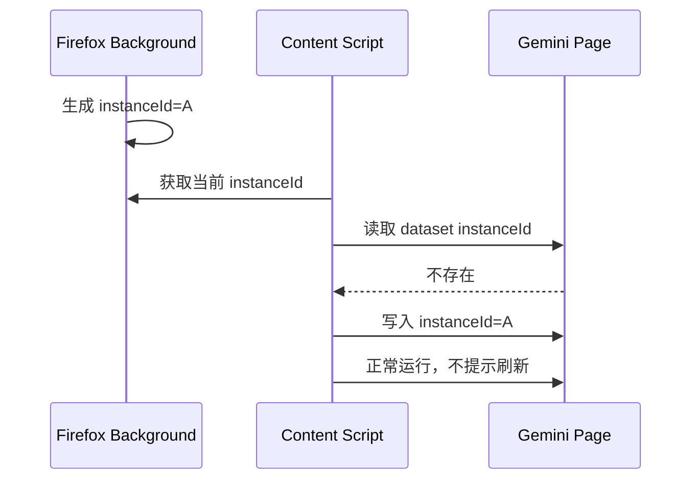
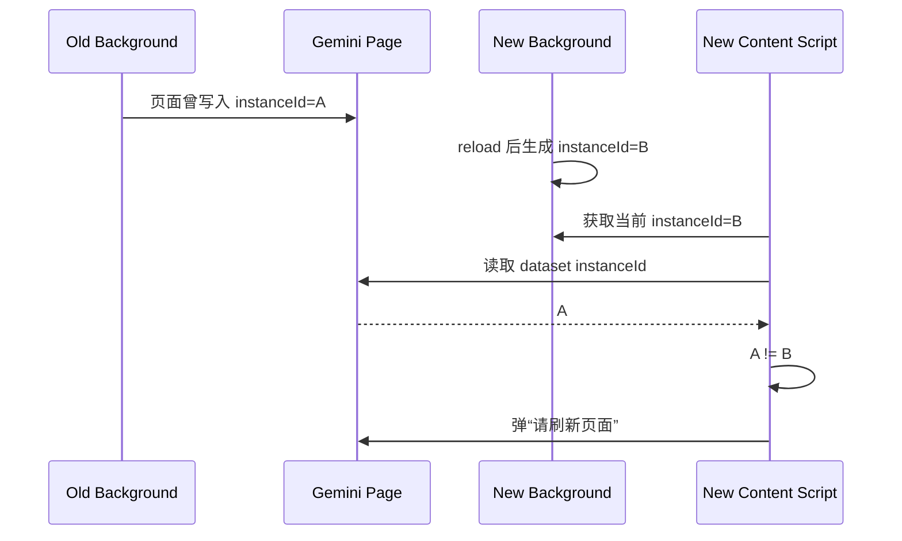
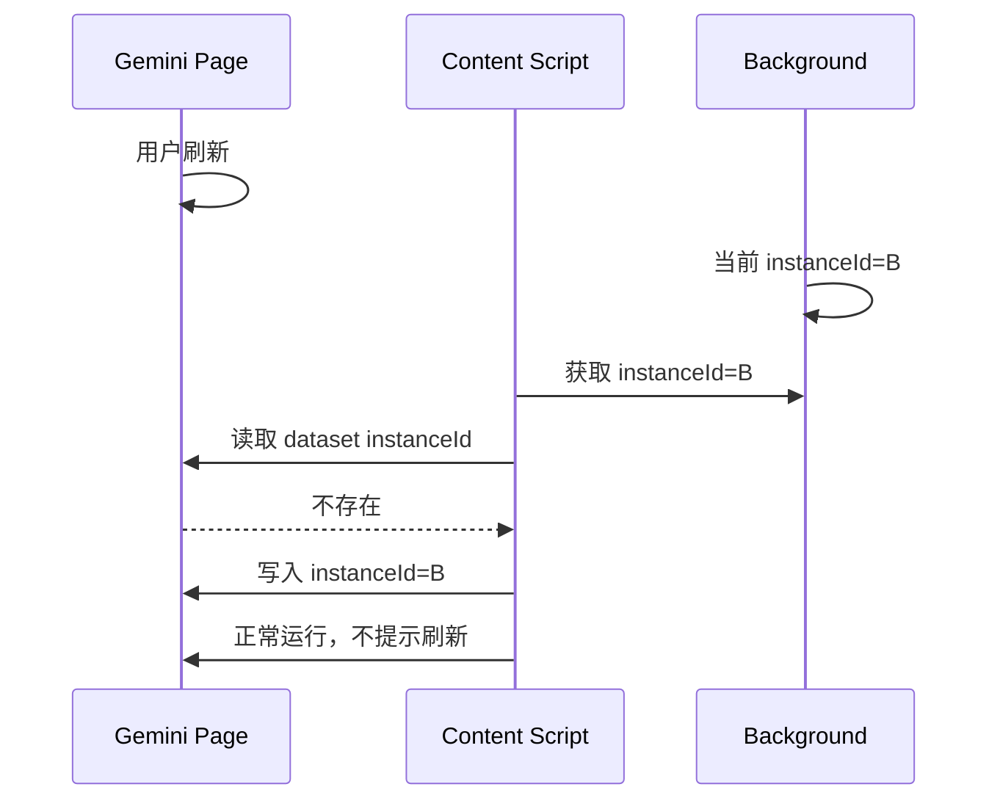

# Firefox 页面刷新提醒方案（简化版）

| 项目 | 内容 |
| :--- | :--- |
| 文档版本 | V2.0 |
| 功能名称 | Firefox 页面刷新提醒 |
| 创建日期 | Mar 26, 2026 |
| 状态 | Draft |

## 1. 目标

本方案只覆盖 Firefox，不改动 Chrome。

核心目标只有一个：

- 当页面属于“旧扩展实例”时，视为上下文已失效，直接弹出“请刷新页面”提醒。

这里不再追求精确区分：

- 是扩展更新导致的
- 是 `about:debugging` 手动 reload 导致的
- 还是临时扩展重新加载导致的

只要能确认：

- 当前页面不是由当前这次扩展实例初始化出来的

就提示刷新。

## 2. 为什么要简化

此前的复杂方案试图处理：

- 更新事件
- tab 状态
- 广播失败重试
- 页面启动补偿
- 页面加载时间与扩展更新时间比较

这些逻辑在 Firefox 上不是不能做，而是超出了当前目标。

当前目标不是“完整建模扩展更新生命周期”，而只是：

- 稳定感知“这个页面已经不是当前扩展实例对应的页面”

因此，更适合 Firefox 的方案应该是：

- 判定简单
- 无后台状态同步依赖
- 不依赖旧 content script 继续活着

## 3. 简化后的核心设计

采用“扩展实例 ID 对比”方案。

### 3.1 核心思路

每次 Firefox 扩展实例启动时，都有一个新的 `instanceId`。

content script 启动时：

1. 获取当前扩展实例的 `instanceId`
2. 读取页面上已有的 `instanceId`
3. 比较两者

结果只有两种：

- 相同：页面属于当前扩展实例，不提示刷新
- 不同：页面属于旧扩展实例，提示刷新

### 3.2 为什么这能代表“上下文失效”

在 Firefox 中，扩展 reload/update 后经常出现：

1. 旧页面文档仍在
2. 新 content script 被重新注入
3. 旧 content script 不一定来得及执行“invalidated”检测

因此，“上下文失效”的本质并不是：

- 旧脚本有没有机会打印日志

而是：

- 这个页面是否还属于旧扩展实例

只要页面上保存的是旧 `instanceId`，而当前运行的是新 `instanceId`，就说明：

- 页面没有经历完整刷新
- 页面状态与当前扩展实例不一致
- 对用户来说，这就是“需要刷新页面”

## 4. 状态枚举

状态压缩为 3 类即可。

- `clean`
  页面上没有旧实例标记，或页面标记与当前实例一致。

- `stale`
  页面标记存在，且与当前扩展实例不一致。
  此时应弹刷新提醒。

- `recovered`
  用户刷新页面后，页面重新由当前实例初始化，状态回到 `clean`。

## 5. 数据设计

## 5.1 后台侧

Firefox 后台脚本在启动时维护一个运行期 `instanceId`。

要求：

- 每次扩展 reload / update / 临时扩展重新加载时，`instanceId` 都应变化
- 不要求跨重启持久化
- 只要求当前实例唯一

可选实现：

- `crypto.randomUUID()`
- 或启动时间戳 + 随机串

## 5.2 页面侧

在页面 DOM 上保存实例标记，例如：

- `document.documentElement.dataset.gpkFirefoxInstanceId`

这个标记的特性：

- 页面不刷新时会保留
- 扩展 reload 后，新 content script 仍可读到旧值
- 页面刷新后会被新文档清空，再由新 content script 重写

这正好满足判断需求。

## 6. 时序图

## Case A：首次加载页面

结果：

- 页面状态 = `clean`

## Case B：扩展 reload，但页面未刷新

结果：

- 页面状态 = `stale`

## Case C：用户刷新页面

结果：

- 页面状态从 `stale` 恢复为 `clean`

## 7. 推荐实现位置

只针对 Firefox。

### 7.1 后台

在 Firefox background 中新增一个很小的实例服务：

- 启动时生成 `instanceId`
- 暴露消息接口给 content script 获取当前 `instanceId`

建议放在：

- `src/entrypoints/background/firefox.ts`

### 7.2 Content script

在 Firefox content 启动早期执行：

1. 请求当前 `instanceId`
2. 读取 `document.documentElement.dataset.gpkFirefoxInstanceId`
3. 比较是否一致
4. 若不一致，展示刷新提醒
5. 若一致或为空，则写入当前值

建议放在：

- `src/entrypoints/content/index.tsx`
- 或 `src/entrypoints/content/overlay/extension-update/index.tsx`

### 7.3 UI

继续复用现有刷新提醒 UI：

- toast
- reload dialog

不需要新增新的视觉组件。

## 8. 风险

## 8.1 Firefox 如果不重注入 content script

若某些场景下 Firefox reload 后没有把新 content script 注入到旧页面，则该方案不会立即触发。

不过从当前调试现象看，Firefox 正是“直接重新注入 content script”，因此该方案是匹配实际行为的。

### 8.2 页面被站点脚本篡改 dataset

理论上页面脚本可能改写 `dataset`。

但这里的标记只用于刷新提醒，不是安全边界。
即使被清除，最坏结果是少提示一次，不影响核心功能正确性。

### 8.3 多 content script 重复提示

若页面中某些逻辑导致重复初始化，需要增加一次性保护，例如：

- `data-gpk-firefox-reload-notified="true"`

否则可能重复弹窗。

## 9. 验证方式

## 9.1 开发模式验证

步骤：

1. 在 Firefox 中临时安装扩展
2. 打开 Gemini 页面
3. 确认页面正常运行
4. 不刷新页面，直接在 `about:debugging` 点击 Reload
5. 返回 Gemini 页签

预期：

- 新 content script 启动
- 读到页面里旧 `instanceId`
- 发现与当前 `instanceId` 不一致
- 弹出刷新提醒

## 9.2 刷新恢复验证

步骤：

1. 页面已出现刷新提醒
2. 点击刷新页面
3. 页面重新加载完成

预期：

- 页面重新写入新的 `instanceId`
- 不再继续提示刷新

## 9.3 多 tab 验证

步骤：

1. 打开多个 Gemini tab
2. 扩展 reload
3. 回到每个 tab

预期：

- 所有未刷新的旧页面都会提示刷新
- 已刷新的页面不提示

## 10. 与当前 `contextMonitor` 的关系

本方案下：

- Firefox 主路径使用 `instanceId mismatch`
- `contextMonitor` 可以保留，但降级为辅助兜底

也就是说：

- 不再依赖 `browser.runtime.id` 失效检测作为主判断
- 即使看不到 `Context invalidated` 日志，也不影响 Firefox 的刷新提醒

## 11. 结论

Firefox 场景下，更简约且贴合当前实际行为的方案是：

- 不做复杂更新建模
- 不做后台 tab 状态同步
- 不做更新时间与页面时间比较

只做一件事：

- 比较“页面记录的扩展实例 ID”与“当前扩展实例 ID”是否一致

若不一致，就视为页面上下文已失效，直接提示刷新。

这已经足够解决当前问题，而且实现成本低、可验证性强、不会影响 Chrome。
