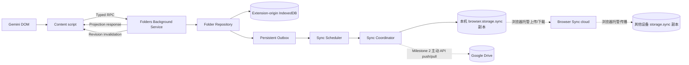
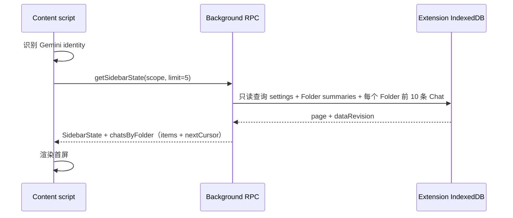
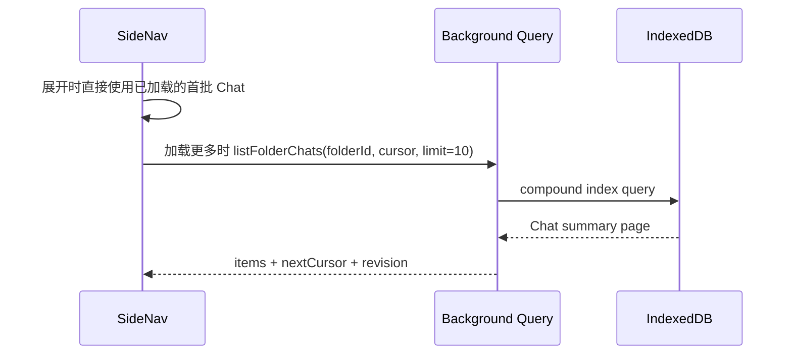
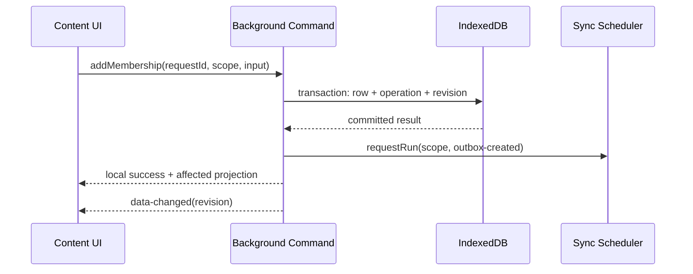
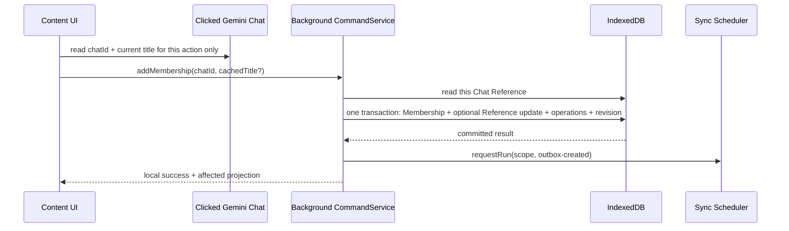
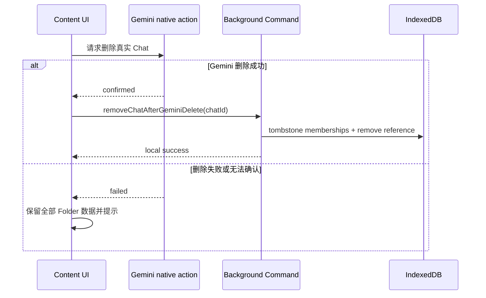
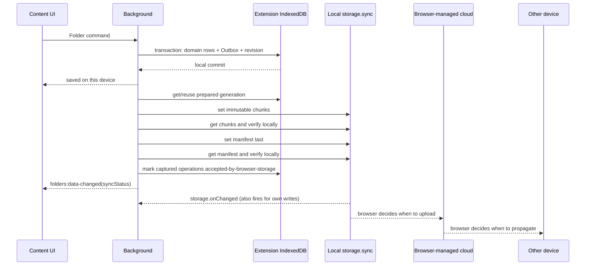
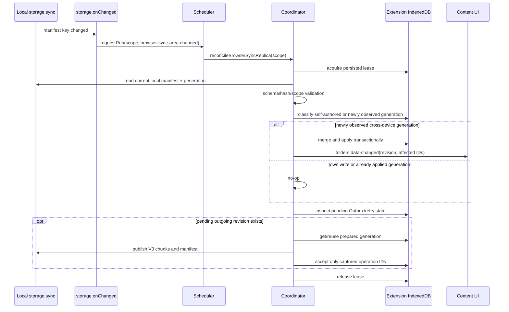
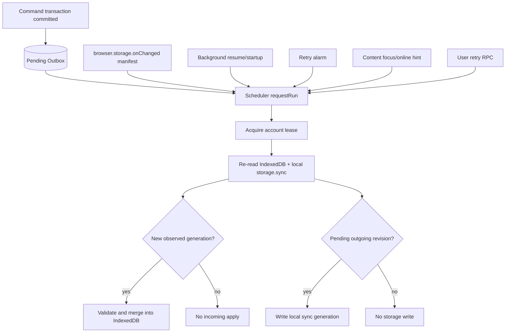

# Folders Background 数据架构改造

> 状态：当前实现基线。本文描述当前 Folders 后台数据边界；Google Drive、跨 provider 迁移与权威切换仍属后续规划。
>
> 当前代码已采用扩展后台持有 Repository、IndexedDB 和 Browser Sync 调度的方案。未发布的旧 Folder 试验数据不迁移；Dexie schema 当前为 v12。
>
> Browser Sync 的数据结构、单 active Manifest、删除后写入、设置独立同步、统一读取、容量控制与回收规则以 [`browser-sync-data-architecture.md`](./browser-sync-data-architecture.md) 为准。下文涉及 Google Drive、跨 provider 迁移与远端确认的设计均为未来规划。

## 1. 决策摘要

Folders 采用 background-owned 架构：

1. Background 是 Folder 领域数据、持久化、备份和同步协调的唯一执行边界；Browser Sync 的云端传播仍由浏览器控制。
2. Folders 数据只写入扩展 origin 下的 `gemini_extension` IndexedDB。
3. Content script 不直接 import Dexie、Folder Repository、Sync Coordinator 或具体同步 provider。
4. Content script 只负责 Gemini DOM、页面身份、交互和临时 UI 状态，通过强类型 RPC 请求 background。
5. UI 按场景分页查询，不把完整账号数据镜像到 content script。
6. 完整账号数据只在 background 内用于同步、备份、导入、导出和恢复。
7. 本地事务先成功，再将待传播 revision 写入本机 `browser.storage.sync`；浏览器何时上传或在其他设备下载不受扩展控制，写入失败不得回滚已提交的本地操作。
8. 页面加载、刷新和普通 projection 查询不得创建 operation、revision、snapshot 或 Browser Sync generation。

目标数据链路：



## 2. 改造原因

本架构取代了早期由 content script 直接访问 Repository、Dexie 和同步服务的实现。当前 `FolderRuntime` 通过 Folder RPC 获取场景化投影并提交命令；扩展后台持有 Repository、Dexie、恢复点与 Browser Sync 调度。页面身份和 Gemini DOM 仍由 content script 管理。Browser Sync 只表示本机 Browser Storage 的写入状态，不表示云端或其他设备确认。

## 3. 目标与非目标

### 3.1 目标

- 建立可供 Folders 及未来用户资产功能复用的 background 数据边界。
- 确保每个 Gemini 账号的数据在查询、写入、同步、备份和通知中严格按 `accountScopeId` 隔离。
- 支持大量 Folder 和 Chat 归属时的分页、按需加载和小消息传输。
- 建立一层最小、规范、可扩展的 content/background Extension RPC 基础封装，并由 Folders 首次使用。
- 保持离线可写、持久 Outbox、确定性合并和恢复点；明确区分 Browser Sync 本地副本 adapter 与具有主动 API 语义的远端 provider。
- 保证 Chrome MV3 service worker 随时终止后仍可从持久状态恢复工作。
- 保持 Chrome 与 Firefox 的同一领域契约，平台差异只留在 provider 和调度 adapter。

### 3.2 非目标

- 不迁移当前调试版本在 Gemini 页面 origin 下的 IndexedDB 数据。
- 不在本次架构改造中实现 Google Drive OAuth 或 Drive provider。
- 不开放子 Folder UI；P0 仍为扁平列表。
- P0 不监听 Gemini Chat 名称变化，也不被动刷新已缓存标题；后续如有明确需求再单独设计。
- 不保存 Gemini Chat 正文、请求、回答、附件或 Gemini 私有页面状态。
- 不把 background 设计成通用 REST、任意表查询或任意 patch 服务。
- 不让 content script 直接访问同步 envelope、Chunk、Outbox 或 snapshot 内容。
- 不重构 Notification、Firefox reload、Stuff Page 等现有业务的 runtime message；它们继续沿用当前通信方式。
- 不在前期引入消息代码生成、依赖注入容器、服务发现、通用 middleware 链或新的 messaging 第三方依赖。

## 4. 运行上下文与职责

### 4.1 Content script

负责：

- 观察 Gemini 页面当前账号并计算 `accountScopeId`。
- 解析当前可确认的 Chat ID 和必要标题。
- 插入 SideNav、原生菜单入口、Folder Picker 和确认 UI。
- 维护 menu、dialog、drag、loading、error 等临时 UI 状态。
- 将用户意图转换为明确的 Folder RPC command。
- 按当前可见区域调用查询 RPC，并缓存当前页面所需的 projection。
- 收到 background invalidation 后按需重新查询。
- 在身份不可用、歧义或变化时立即清空前一 scope 的页面缓存和原生隐藏样式。
- 调用 Gemini 原生删除 Chat；只有确认 Gemini 删除成功后，才通知 background 清理 Folder 索引。

不负责：

- 打开或写入 Folders IndexedDB。
- 生成 HLC、operation、revision、snapshot 或同步 envelope。
- 直接调用 `browser.storage.sync` 或 Google Drive。
- 决定跨设备副本或远端 provider 的冲突结果。
- 保存跨页面、跨标签或跨 service-worker 生命周期的领域状态。

### 4.2 Background

负责：

- 注册 Folders RPC、同步调度、alarm 和 `browser.storage.onChanged` 监听器。
- 校验消息结构、sender、账号 scope 和 identity source。
- 执行所有 Repository 查询与命令。
- 维护 extension-origin IndexedDB、事务、索引和 schema version。
- 管理 HLC、device ID、operation、revision、tombstone、snapshot 和同步租约。
- 调度对本机 Browser Sync 副本的观察与写入；Milestone 2 接入可主动 push/pull 的 Google Drive。
- 将新观察到的跨设备副本或 Drive 远端数据校验、合并并原子应用到本地数据库。
- 发布轻量 invalidation，通知 content script 数据 revision 已变化。
- 从持久状态恢复中断任务，不依赖未持久化的全局队列。

不负责：

- 读取或修改 Gemini DOM。
- 推断当前页面登录账号。
- 执行 Gemini 原生 Chat 删除。
- 长期持有 tab、port、账号或任务的无界内存 Map。
- 向 UI 声称 Browser Sync 已被云端服务器确认。

### 4.3 Browser Sync Adapter 与远端 Provider

Browser Sync 不能抽象成具备云端确认能力的普通远端 Provider。扩展只能读写当前设备可见的 `browser.storage.sync` 区域；上传、下载、重试和跨设备传播由浏览器管理。因此 P0 使用语义明确的本地副本 adapter：

```ts
interface BrowserSyncReplicaAdapter {
  readLocalManifest(accountScopeId: string): Promise<BrowserSyncManifest | undefined>
  readLocalGeneration(descriptor: BrowserSyncGenerationDescriptor): Promise<FolderSyncEnvelope>
  writeLocalGeneration(generation: PreparedFolderGeneration): Promise<BrowserStorageWriteReceipt>
  cleanupLocalGenerations(input: FolderGenerationCleanupInput): Promise<void>
}

interface BrowserStorageWriteReceipt {
  generationId: string
  dataRevision: string
  acceptedAt: string
  usedBytes: number
  quotaBytes: number
  warning?: 'near-quota'
}
```

`BrowserStorageWriteReceipt` 只记录本机 `browser.storage.sync.set()` 已接受写入，不证明数据已上传到浏览器云端或到达其他设备；当前实现不做成功后的确认回读。

Milestone 2 的 Google Drive 通过显式网络 API 工作，可以实现单独的远端 Provider 契约，例如 `pullRemoteState`、`pushGeneration` 和服务端版本回执。两类 adapter/provider 可以复用 envelope、codec 和 merge 规则，但不能共用“云端已确认”的状态语义。

Adapter/Provider 均不读取业务表、不创建本地 operation、不决定合并结果，也不改变 IndexedDB 作为当前设备业务主库的地位。

## 5. 数据所有权与存储边界

### 5.1 IndexedDB

Folders 的唯一主数据库位于扩展 origin：

```text
chrome-extension://<extension-id>/gemini_extension
moz-extension://<extension-id>/gemini_extension
```

建议继续使用统一数据库名 `gemini_extension`，方便未来把其他用户资产能力逐步收敛到 background。约束如下：

- 生产环境只有 background 可以 import `db.ts` 和 Folder Repository。
- Content script 通过 `FolderBackgroundClient` 访问 Folders。
- 单元测试和 Repository 集成测试可以直接构造测试数据库。
- 不读取、复制或删除 Gemini 页面 origin 中现有试验数据库。

### 5.2 Folder 领域表

沿用现有领域表，并增加持久化 generation：

| 表 | 职责 | 是否进入同步 payload |
| --- | --- | --- |
| `folders` | Folder 元数据、父级、排序和 tombstone | 是 |
| `folder_memberships` | Folder 与 Chat 多对多关系、排序和 tombstone | 是 |
| `folder_chat_references` | 必要的 Chat ID 与标题缓存 | 是 |
| `folder_settings` | 账号级 Folder 设置；仅 `enabled`、`hideOrganizedChats` 和版本进入 Manifest，收起状态仅本机保存 | 部分 |
| `folder_operations` | 本地持久 Outbox | 否 |
| `folder_sync_states` | sync mode、已观察/已应用/已写入 revision、重试和错误状态 | 否 |
| `folder_sync_generations` | 已准备、可幂等重试的同步 generation | 否 |
| `folder_snapshots` | 本地恢复点、去重 hash 与操作保护租约 | 否 |
| `folder_recovery_states` | 本地自动点分组与恢复失败状态 | 否 |
| `folder_coordinator_leases` | 每账号同步租约 | 否 |

P0 的 Folder 均使用根父级标识，UI 不允许创建子 Folder；底层继续保留 `parentFolderId` 和同父级排序索引。

### 5.3 Browser Storage

| 存储 | 用途 |
| --- | --- |
| `browser.storage.local` | installation device ID、`gpk.folders.account-history.v1` 本机账号历史；没有已实现的 Drive bootstrap |
| `browser.storage.sync` | 当前 V3 的一个活动 Manifest 与其 Chunk；未来 provider 切换时的 Bootstrap 尚未实现 |
| `browser.storage.session` | 可丢失的短期提示，不作为 Folder 数据或同步正确性的依赖 |

`browser.storage.sync` 不是业务数据库，也不是可由扩展控制的云端 API。`set()` 只修改当前设备的同步存储视图并把后续传播交给浏览器；`get()` 只读取当前设备此刻可见的同步存储视图，不会发起网络 pull；成功写入不能证明云端或其他设备已经收到数据。

## 6. Background 内部分层

```text
src/
├── integrations/extension-rpc/
│   ├── contract.ts                # 通用 request/result/error 信封
│   ├── client.ts                  # sendMessage、timeout、response validation
│   └── router.ts                  # namespace/method 路由、schema/sender validation
├── domain/folder/
│   ├── types.ts
│   ├── schemas.ts
│   ├── rpc.ts                     # RPC request/response/domain error
│   ├── query.ts                   # summary、cursor、projection 类型
│   ├── hlc.ts
│   └── order-key.ts
├── data/
│   ├── db.ts
│   └── repositories/
│       └── folderRepository.ts
├── services/folder-sync/
│   ├── coordinator.ts
│   ├── scheduler.ts
│   ├── merge.ts
│   ├── codec.ts
│   └── providers/
│       ├── browser-sync-replica.ts # 本机 storage.sync adapter
│       └── google-drive.ts         # Milestone 2
├── entrypoints/background/folders/
│   ├── index.ts                    # 同步注册所有事件监听器
│   ├── rpc-handler.ts
│   ├── query-service.ts
│   ├── command-service.ts
│   └── invalidation.ts
└── entrypoints/content/folders/
    ├── client.ts                   # FolderBackgroundClient
    ├── runtime.ts                  # 页面 projection 与 UI command adapter
    └── ...                         # DOM/UI controllers
```

依赖方向：

```text
Content UI/DOM → Folder Client → Extension RPC Client → Folder RPC Contract
                                                        ↓
Background Runtime → Extension RPC Router → Folder Query/Command Service
                                                        ↓
                                                Repository → Dexie
                                                        ↓
                                                 Sync Scheduler
                                                        ↓
                                              Coordinator → Replica Adapter / Remote Provider
```

禁止反向依赖：Repository 和同步服务不得 import content、React、Chakra 或 Gemini DOM 模块。

## 7. RPC 封装

### 7.1 范围与演进原则

Folders 当前通过 `src/integrations/extension-rpc` 的共享信封、client 和 router 执行 content/background 通信，并在 `src/domain/folder/rpc.ts` 定义 Folders 专属 method、参数、响应和错误 schema。其他既有 runtime message 仍保持各自实现，不因 Folders RPC 自动迁移。

本次新增最小共享基础层 `src/integrations/extension-rpc`，但只迁移和服务 Folders。现有业务不改造、不改名、不统一到新接口，避免扩大回归范围。后续业务只有在自身发生明确的 background 化或通信重构需求时，才可独立评估接入。

共享层只提供五项能力：

1. 固定的 protocol version、namespace、method、request ID 和 success/error 信封。
2. `browser.runtime.sendMessage` 调用、超时和 transport 异常归一化。
3. Background 对 namespace/method 的路由，以及非目标消息返回 `undefined` 的兼容行为。
4. 调用方提供的 request/response schema 校验和 sender validator hook。
5. 可注入的 transport 和 clock，仅用于单元测试，不抽象 Browser Storage、Repository 或业务服务。

共享层明确不提供：

- 自动重试、缓存、分页、乐观更新和数据 invalidation；这些属于具体领域。
- 通用 CRUD、任意 method 字符串执行或动态 handler 注册中心。
- 跨 main world、native messaging 或网络 HTTP 的统一 transport。
- 全局单例状态、无界 pending Map 或长期 Port 管理。
- 自动修改现有 `src/types/runtime-messages.ts` 消息消费者。

建议的最小公开 API：

```ts
interface ExtensionRpcClient {
  request<TRequest, TResponse>(
    request: ExtensionRpcRequest<TRequest>,
    responseSchema: z.ZodType<TResponse>,
    options?: { timeoutMs?: number; signal?: AbortSignal },
  ): Promise<ExtensionRpcResult<TResponse>>
}

interface ExtensionRpcRoute<TRequest, TResponse> {
  namespace: string
  method: string
  requestSchema: z.ZodType<TRequest>
  responseSchema: z.ZodType<TResponse>
  validateSender(sender: Runtime.MessageSender): boolean
  handle(request: TRequest, sender: Runtime.MessageSender): Promise<TResponse>
}

function createExtensionRpcRouter(
  routes: readonly ExtensionRpcRoute<unknown, unknown>[],
): Runtime.OnMessageListener
```

Folders 的 method、参数、projection、错误映射和业务校验保留在 `domain/folder/rpc.ts` 与 background Folder services 中。共享层不得 import Folder 类型，从而保留未来复用能力，同时保持前期实现足够小。

### 7.2 统一信封

所有请求使用可判别联合，并在 background 边界使用 zod 校验：

```ts
interface FolderRpcEnvelope<TMethod extends FolderRpcMethod, TParams> {
  namespace: 'folders'
  protocolVersion: 1
  requestId: string
  method: TMethod
  accountScopeId: string
  identitySource: 'observed' | 'manual-confirmed'
  params: TParams
}

type FolderRpcResponse<T> =
  | {
      ok: true
      requestId: string
      dataRevision: string
      data: T
    }
  | {
      ok: false
      requestId: string
      error: {
        code: FolderRpcErrorCode
        message: string
        retryable: boolean
        currentRevision?: string
      }
    }
```

`requestId` 只用于当前调用关联和脱敏日志，不持久化、不进入同步 payload。原始邮箱不通过 Folder RPC 传输；background 只接收 `accountScopeId` 和身份来源。

### 7.3 消息来源校验

Background 在执行命令前必须：

1. 确认消息符合 RPC schema。
2. 确认 `sender.id === browser.runtime.id`。
3. 对来自 content script 的请求，确认 sender 来自已注入的 Gemini 页面。
4. 校验 `accountScopeId` 格式并将其强制传入每个 Repository 方法。
5. 拒绝任何跨账号、无 scope 或通用表读取请求。
6. `manual-confirmed` 使用所选邮箱派生的同一 `accountScopeId`；后台对该 scope 执行与自动识别相同的 Folder 查询、命令和 Browser Sync 调度。身份来源只用于说明选择方式，不是登录证明，也不构成后台可验证的 Gemini 当前账号认证。

已保存的账号历史通过独立的 `folder-accounts` RPC 维护，规范化邮箱、scope、最近使用时间和最近选择的 scope 保存在 `browser.storage.local`。Folder RPC 不传输原始邮箱，业务表、同步 payload 和导出文件也不包含邮箱。

### 7.4 错误码

RPC 不直接暴露 Dexie、provider 或内部异常字符串：

```ts
type FolderRpcErrorCode =
  | 'INVALID_REQUEST'
  | 'INVALID_SENDER'
  | 'IDENTITY_UNAVAILABLE'
  | 'ACCOUNT_SCOPE_MISMATCH'
  | 'NOT_FOUND'
  | 'DUPLICATE_NAME'
  | 'STALE_REVISION'
  | 'VALIDATION_FAILED'
  | 'STORAGE_UNAVAILABLE'
  | 'SYNC_DEFERRED'
  | 'INTERNAL_ERROR'
```

用户操作只把本地提交失败视为 command 失败。同步失败通过 `getSyncStatus` 单独呈现，不把已经成功的本地操作改成失败。

## 8. 查询接口

查询接口按页面场景返回最小 projection，不返回完整账号数据。

### 8.1 类型

```ts
interface FolderSummary {
  id: string
  parentFolderId: string
  name: string
  iconKey: string
  colorKey: string
  orderKey: string
  chatCount: number
  collapsed: boolean
}

interface FolderChatSummary {
  chatId: string
  cachedTitle: string
  orderKey: string
  pinnedOrderKey?: string
}

interface CursorPage<T> {
  items: T[]
  nextCursor?: string
}
```

Cursor 由稳定的 `orderKey + id` 编码，不使用数组 offset。响应始终带 `dataRevision`；如果排序相关 command 使用了过期 revision 或相邻边界已变化，background 返回 `STALE_REVISION`，content 重新查询后再操作。

### 8.2 查询清单

| Method | Params | 返回 | 使用场景 |
| --- | --- | --- | --- |
| `folders.getSidebarState` | `{ folderLimit }` | settings、首屏 Folder summary、Folder `nextCursor`、`chatsByFolder`（每个 Folder 前 10 条 Chat 和独立 `nextCursor`，含收起状态的 Folder） | SideNav 首次加载 |
| `folders.listFolders` | `{ cursor?, limit }` | Folder summary page | See more、长列表 |
| `folders.listFolderChats` | `{ folderId, cursor?, limit }` | Chat summary page | 后续 Folder 首屏、Chat 加载更多 |
| `folders.getPickerOptions` | `{ chatId, cursor?, limit }` | Folder summary page + membership 状态 | Add to Folder Picker |
| `folders.resolveChatMemberships` | `{ chatIds }` | 已归类 Chat ID 集合 | Recents 隐藏判断 |
| `folders.getFolderDeleteImpact` | `{ folderId }` | 去重 Chat 数量 | 删除 Folder 确认 |
| `folders.getSettings` | `{}` | Folder settings | Settings 页面 |
| `folders.getSyncStatus` | `{}` | 用户可展示的同步状态 | Settings/SideNav 状态 |
| `folders.listSnapshots` | `{ cursor?, limit }` | Snapshot metadata page | 历史版本 |
| `folders.getRestoreImpact` | `{ snapshotId }` | Folder/Chat/排序影响摘要 | 恢复确认 |

Browser Sync 模式下，`folders.getSyncStatus` 返回可证明的本地状态，不返回 `isCloudSynced` 或 `lastSuccessfulSyncAt`：

```ts
interface BrowserSyncStatusProjection {
  mode: 'browser-sync'
  state: 'local-changes-pending' | 'accepted-by-browser-storage' | 'needs-attention'
  lastLocalSaveAt?: string
  lastBrowserStorageWriteAt?: string
  retryAt?: string
  warning?: 'near-quota' | 'write-failed' | 'invalid-replica'
}
```

`accepted-by-browser-storage` 的展示含义是“已写入浏览器同步存储，浏览器将自行同步”，不是“已同步到云端”。Google Drive 模式未来使用独立的 status projection，只有收到明确服务端 response 后才能展示远端确认信息。

限制：

- `limit` 由 schema 约束，background 设置上限；调用方不能请求无限数量。
- `resolveChatMemberships.chatIds` 只接收当前已解析的有限批次，并设置数量上限。
- Picker 通过滚动继续分页，最终仍可访问全部 Folder，符合产品“展示全部 Folder”的要求。
- SideNav 默认只查询前五个 Folder；展开某个 Folder 时才查询其 Chat。
- Content script 不因一个标题变化而重新获取所有 Folder 和 Membership。

### 8.3 Background-only 全量接口

下列方法不是 RPC，不向 content script 暴露：

```ts
exportAccountData(accountScopeId)
createSyncEnvelope(accountScopeId, revision)
createSnapshot(accountScopeId, reason)
mergeSyncCandidate(accountScopeId, payload)
replaceAccountData(accountScopeId, payload)
```

它们仅供同步、快照、导入、导出和恢复流程调用。

## 9. Command 接口

Command 表达完整用户意图，并由 background 在事务中执行：

| Method | 关键参数 | 原子结果 |
| --- | --- | --- |
| `folders.createFolder` | name、icon、color、position | 新 Folder + operation |
| `folders.createFolderAndAddChat` | Folder input、chatId、`cachedTitle?` | Folder、Membership、Reference + operations |
| `folders.updateFolder` | folderId、patch | 字段版本更新 + operation |
| `folders.moveFolder` | folderId、beforeId/afterId、expectedRevision | 顺序更新/必要重平衡 + operation |
| `folders.deleteFolder` | folderId、expectedRevision | 保护快照 + subtree/membership tombstone + operation |
| `folders.addMembership` | folderId、chatId、`cachedTitle?` | Membership/Reference + operation |
| `folders.moveMembership` | source/target、chatId、position | source tombstone + target row + operation |
| `folders.setMembershipPinned` | folderId、chatId、pinned | 当前 Membership 置顶状态与版本 + operation + 自动恢复点 |
| `folders.removeMembership` | folderId、chatId | Membership tombstone + operation |
| `folders.removeChatAfterGeminiDelete` | chatId、deletionReceipt | 全部 Membership tombstone + Reference 删除 |
| `folders.updateSettings` | patch | 字段版本更新 + operation |
| `folders.importBackup` | 已校验 backup | 保护快照 + 全量替换 + operation |
| `folders.restoreSnapshot` | snapshotId、expectedRevision | 保护快照 + 恢复 + operation |

Command 返回受影响的最小 projection，例如新 Folder summary、更新后的 Folder Chat page 或 settings；不默认返回完整 SideNav 数据。

### 9.1 幂等与去重

- 每个 command 带 `requestId`；background 保存短期、有限的已提交 command receipt，或使用可推导实体 ID 保证重复消息不会重复创建资产。
- receipt 必须有 TTL 和数量上限，不能成为无界 background 内存 Map。
- `addMembership` 使用稳定的 `accountScopeId + folderId + chatId` identity，重复添加为 no-op。
- `createFolderAndAddChat` / `addMembership` 只在对应显式操作中比较该 Chat 的 Reference；规范化标题未变化时不额外写 `chat-reference.update` operation。
- 查询请求永远不产生持久化副作用。账号尚无 `folder_settings` 时，QueryService 返回领域默认值但不落库；该账号的第一次 mutation 再在同一事务中持久化 settings 和 sync state。

## 10. Invalidation 与 Content 缓存

Background 数据发生本地提交、同步副本合并或 Drive 远端合并后，发送轻量通知：

```ts
interface FolderDataChangedMessage {
  type: 'folders:data-changed'
  accountScopeId: string
  dataRevision: string
  affected: {
    folderIds?: string[]
    chatIds?: string[]
    settings?: boolean
    syncStatus?: boolean
  }
}
```

通知不携带完整 projection。Content script 按当前界面决定是否查询：

- scope 不同：忽略。
- 当前 Folder 未展开：不查询其 Chat。
- 当前页受影响：刷新对应 page。
- 只改变 sync status：只调用 `getSyncStatus`。
- 当前 Gemini 身份变化：先清空全部旧 scope 缓存，再请求新 scope 首屏。

Background 不维护永久 tab registry。需要广播时从浏览器当前 tab 状态派生目标，发送失败视为目标没有活动 content script，不保存重试队列。当前发起 command 的页面可直接使用 command response 更新，无需等待广播。

`folders:data-changed` 是 Background → Content 的 UI invalidation，不是同步调度事件。它不触发 generation 写入，也不携带同步 payload。同步状态变化时只设置 `affected.syncStatus = true`；Content 收到后按需调用 `folders.getSyncStatus`。

## 11. 数据流转

### 11.1 页面启动与刷新



硬性不变量：页面启动、刷新、focus 和只读查询不得创建新 operation、revision、snapshot、generation 或 Chunk。它们最多发送一次可丢失的同步检查提示；Coordinator 在无 pending Outbox 且本机 Browser Sync manifest 未出现新 generation 时必须零写入返回。`storage.sync.get()` 是本地读取，不应被描述为一次 cloud pull。

### 11.2 展开 Folder 与加载更多



Folder 收起时可以释放 Chat page 缓存；再次展开允许按 revision 判断复用或刷新。

### 11.3 本地 Command



UI 成功状态以本地事务为准，不等待 Browser Sync。Scheduler 唤醒失败不改变 command 结果，因为 pending operation 已持久化；下次 alarm、background 恢复、online/focus 提示或 storage change 事件会继续处理。

### 11.4 Chat 标题缓存（仅显式操作写入）

P0 不注册 Chat 标题 `MutationObserver`，不扫描 SideNav Chat 列表，也不提供 `reconcileVisibleChatTitles` RPC。Gemini 中的 Chat 名称发生变化时，Folders 不会被动感知或创建同步 operation。

`cachedTitle` 只在用户明确执行以下操作时，由 Content 从当前交互目标读取并随 command 发送：

- `createFolderAndAddChat`；
- `addMembership`。

读取范围仅限用户点击的 conversation link 或当前 Chat，不遍历其他 Chat。Content 优先读取已知 title selector，无法唯一解析时回退到 link `aria-label`；随后执行 NFKC、连续空白折叠、trim 和 500 字符上限校验。标题正文不得写入日志。

Background 在对应 Membership transaction 中处理 `cachedTitle?`：

1. 有合法标题且 Reference 不存在：创建 Chat Reference。
2. 有合法标题且与现有 `cachedTitle` 不同：更新同一 Reference，并写入 `chat-reference.update` operation。
3. 有合法标题且相同：Reference 严格 no-op。
4. 未取得合法标题但已有 Reference：保留原值。
5. 未取得合法标题且没有 Reference：创建空标题占位；UI 使用本地化的“未命名对话”展示，不伪造 Gemini 标题。

Membership、Reference 和需要的 operations 在同一个 IndexedDB transaction 中提交，并只推进一次账号 `dataRevision`。同一 Chat 后续加入另一个 Folder 时，如果这次显式操作携带了不同的有效标题，可以顺带刷新唯一 Reference。



代价是：用户在 Gemini 中重命名 Chat 后，Folders 可能继续显示旧缓存名称；直到该 Chat 再次参与上述显式 Folder 操作、Import 或 Restore 才可能更新。这是 P0 为降低 DOM 观察、RPC、并发去重和同步写放大复杂度而接受的限制。

### 11.5 删除 Gemini Chat



Background 不能自行调用或假设 Gemini 删除成功。

### 11.6 Browser Sync 本地副本协作

Browser Sync 没有扩展可调用的 cloud push/pull。以下流程中的 `read` 和 `write` 始终针对本机 `browser.storage.sync`；虚线部分完全由浏览器实现，扩展无法获知其开始、完成或失败时间。



另一台设备获得变化时，浏览器先更新该设备本机的 `storage.sync`，随后事件只负责唤醒 Background：



关键约束：

- `storage.onChanged` 对本机 `set()` 和浏览器传播到本机的变化都可能触发，事件本身不提供可信的来源设备或“来自云端”标志。
- `storage.onChanged` 与发起 `set()` 的 Promise continuation 可能交错；正确性依赖 lease、generation 记录和对活动副本的后续完整校验，不依赖两者到达顺序。
- Listener 只匹配 `areaName === 'sync'` 的 Folder manifest key。Chunk 先写、manifest 后写，因此 Chunk 变化不直接触发 merge。
- 浏览器跨设备传播不同 key 时不保证扩展能观察到与本机写入相同的到达顺序；如果 Manifest 已到但 Chunk 尚不完整，保留本地 IndexedDB 数据并设置短退避 retry。后续即使 Chunk 事件被过滤，retry 仍会重新读取完整 generation。
- 事件的 `newValue` 只作为唤醒提示；Coordinator 必须重新读取完整 manifest/generation 并完成校验，不能直接应用事件 payload。
- Coordinator 通过 generation ID、content hash 和持久化的 `folder_sync_generations` 判断是否为本机刚写入、已经应用或新观察到的跨设备候选。
- 本机写入产生的 `onChanged` 允许重复唤醒，但必须归类为 self-authored 并零写入结束，不得生成下一条 generation。
- manifest 被移除或内容损坏不等于“远端删除全部 Folders”；保留 IndexedDB 数据并进入需处理状态，禁止用空数据覆盖本地。
- 确定性 merge 如果产生了不同于已观察副本的新本地 revision，应创建新的 Outbox 工作以便后续传播；如果本地结果与副本完全相同则不创建 operation。
- 发布前若活动 Manifest 已被另一 generation 取代，本轮不能把 Outbox 标记为 accepted；先合并新候选，再复用或重建与当前 revision 对应的 generation。

## 12. Sync Scheduler 与 MV3 生命周期

Background service worker 不是常驻进程。Scheduler 使用持久状态，而不是只依赖 Promise、timer 或内存队列。

### 12.1 事件与触发关系

同步调度统一收敛到一个 background 内部入口，不通过 content `eventBus` 传输同步数据：

```ts
type FolderSyncRunReason =
  | 'outbox-created'
  | 'browser-sync-area-changed'
  | 'background-resume'
  | 'retry-alarm'
  | 'content-activity-hint'
  | 'user-retry'

interface FolderSyncScheduler {
  requestRun(accountScopeId: string, reason: FolderSyncRunReason): void
}
```

`reason` 只用于调度、诊断和测试，不作为同步正确性的事实来源，也不写入 envelope。Scheduler 可以在当前 service-worker 生命周期内合并同账号的重复唤醒，但合并集合必须有清理边界；service worker 被终止后应能仅凭持久状态恢复。

| 原始事件 | 注册位置 | 前置条件 | 调度 reason | 允许的副作用 |
| --- | --- | --- | --- | --- |
| Folder command 已提交 | `CommandService` | IndexedDB transaction 成功 | `outbox-created` | 处理 pending Outbox |
| `browser.storage.onChanged` | Background 初始化 | `areaName === 'sync'` 且 key 为当前 scope 的 Folder manifest | `browser-sync-area-changed` | 重新读取并校验本机同步副本 |
| Background 模块恢复 / `runtime.onStartup` | Background 初始化 | IndexedDB 已知 scope、同步存储中的 Folder manifest scope 或当前活动 scope | `background-resume` | 恢复 prepared generation、到期 retry，并观察当前 manifest |
| `browser.alarms.onAlarm` | Background 初始化 | Folder retry alarm 且 `retryAt <= now` | `retry-alarm` | 重试仍然存在的持久工作 |
| Content `focus` / `online` | Content，经轻量 RPC 提示 | 已观察到可信 `accountScopeId` | `content-activity-hint` | 仅检查，不保证发生网络 pull |
| 用户点击重试 | `folders.retrySync` RPC | 当前 scope 且状态允许 | `user-retry` | 清除可重试等待并立即检查 |

依赖链如下：



### 12.2 持久事实与状态命名

三类持久事实共同决定“是否有工作”，不能只依赖事件是否到达：

1. 出站工作：`folder_operations` 中存在 `pending` operation，或存在尚未被本机 Browser Storage 接受的 prepared generation。
2. 入站工作：本机 manifest 指向的有效 generation 与 `lastObservedReplicaGenerationId` 不同。
3. 重试工作：`folder_sync_states.retryAt` 已到期。

Browser Sync 模式建议使用以下字段，避免出现云端确认暗示：

```ts
interface BrowserSyncState {
  accountScopeId: string
  localDataRevision: string
  lastObservedReplicaGenerationId?: string
  lastObservedReplicaRevision?: string
  lastAppliedReplicaRevision?: string
  lastWrittenReplicaGenerationId?: string
  lastWrittenReplicaRevision?: string
  lastBrowserStorageWriteAt?: string
  lastAttemptAt?: string
  retryAt?: string
  lastErrorCode?: string
  warning?: 'near-quota' | 'write-failed' | 'invalid-replica'
}
```

Outbox 和 generation 的交付状态同样使用通道实际能证明的语义：

```ts
type FolderOperationDeliveryState =
  | 'pending'
  | 'accepted-by-browser-storage'
  | 'confirmed-by-remote-provider' // 仅用于 Drive 等显式远端 API
```

Browser Sync 模式不使用 `uploading`、`confirmed`、`lastUploadedRevision`、`lastSuccessfulSyncAt` 或 `cloudConfirmedAt`。UI 可以区分“本机已有待写入更改”“已写入浏览器同步存储，浏览器将自行同步”和“同步存储需要处理”；不能判断当前是否正在上传、是否已经传到云端、是否已经到达其他设备，也不能显示无法验证的云端成功时间。

### 12.3 生命周期规则

1. 事件只是 wake-up hint；每次运行都重新读取 IndexedDB 与当前本机 `storage.sync`，不相信内存队列或事件 payload。
2. Alarm 只负责唤醒；`retryAt` 和失败状态保存在 IndexedDB。
3. 同账号同时只有一个有效 Coordinator lease；lease 有 TTL，service worker 中断后可过期恢复。
4. Background 初始化时同步注册 `runtime.onMessage`、`storage.onChanged`、`alarms.onAlarm` 和必要的启动监听器，再异步执行恢复检查。
5. 不使用无清理的账号 Map、无限重试 timer 或长期持有的 Port registry。
6. Browser Storage 配额或写入错误采用有上限的指数退避，并保留用户本地操作。
7. `content-activity-hint` 可以被丢弃或合并；它不是正确性依赖。Background 恢复和 retry alarm 必须足以继续出站工作，当前 manifest 重读必须足以发现未应用的入站候选。
8. Content 的 `focus`/`online` 不能被称为 pull，也不能直接创建 operation、generation 或 Chunk。
9. Background 恢复时，从 IndexedDB 中的已知 scope 与 `storage.sync` 中匹配 Folder manifest 命名规则的 scope 取并集；只解析 manifest key，不向 content 暴露跨 scope 列表。

如果引入 `browser.alarms`，应将 `alarms` 加入 manifest 权限，并在 Chrome/Firefox 构建产物中验证。

## 13. Generation 幂等与垃圾回收

### 13.1 Prepared generation

同一个 `dataRevision` 的重试必须复用同一个 generation，而不是每次调用 `nanoid()`：

```ts
interface FolderSyncGenerationRow {
  id: string
  accountScopeId: string
  syncMode: 'browser-sync' | 'google-drive'
  syncEpoch: string
  dataRevision: string
  includedOperationIds: string[]
  payloadHash: string
  payload: string
  createdAt: string
  state:
    | 'prepared'
    | 'writing'
    | 'accepted-by-browser-storage'
    | 'confirmed-by-remote-provider'
    | 'superseded'
}
```

压缩业务 `payload` 在 prepare 时一次性生成并持久化。后续重试不得重新计算 `exportedAt`、`generatedAt`、payload 或 hash。这样页面、service worker 或 adapter/provider 中断后，重试只覆盖同一组 Chunk key。

当新 command 产生新 revision 时，旧 prepared generation 可以先完成本机 Browser Storage 接受流程；完成时只能把 `includedOperationIds` 标记为 `accepted-by-browser-storage`，新 operation 保持 pending 并触发下一轮 generation。该状态不表示浏览器云端或其他设备已经收到数据。

### 13.2 Manifest 与清理

Browser Sync 保留：

```text
manifest
active generation only
当前本地 prepared/writing generation（本机写入进行中时）
```

发布前将被替换 generation ID 持久化到本地 prepared generation。Provider 先移除旧活动 generation 的 Chunk，再一次写入新 Chunk 与 Manifest；成功后只保留活动副本。本机写入中断时，Scheduler 根据 incomplete Manifest 和本地 prepared/writing 记录复用同一 generation 完成重试。Provider 不保留远端 previous generation，且不对成功写入做确认回读。

清理失败：

- 不影响刚完成的本机 Browser Storage 写入结果；
- 记录可重试的容量警告；
- 下次成功写入本机同步存储或维护任务继续清理；
- 不删除无法验证归属或其他 `accountScopeId` 的 key。

### 13.3 禁止刷新写入

以下场景必须保持 generation 数量和 `dataRevision` 不变：

- 刷新 Gemini 页面；
- 重建 content script；
- 重开或切换 SideNav；
- 重复读取相同 projection；
- Gemini DOM 重绘或 Chat 标题变化，但用户未执行 Folder command；
- focus/online 提示触发同步检查，但本地无 pending 且本机 manifest 没有新 generation。

## 14. 同步副本合并与账号隔离

Coordinator 从本机 Browser Sync 副本读取新的候选 generation 后依次校验：

1. Envelope app、schema 和 protocol version。
2. `accountScopeId` 与当前 sync job 一致。
3. sync mode 与 sync epoch 符合当前控制面状态。
4. Chunk 完整、内容 hash 正确、payload 可解压并通过 zod schema。
5. 该 generation 尚未被本地观察和应用。

合并沿用确定性规则：

- Folder 名称、图标、颜色和位置按字段版本戳合并。
- Membership 加入可并存，位置独立版本化。
- Folder 和 Membership 删除使用 tombstone，旧更新不得复活。
- Chat 标题按标题版本戳选择。
- Settings 独立存在 Manifest 中，按 settingsVersion 整体合并；collapsedFolderIds 仅本设备保存。
- 排序相同时使用稳定 ID 作为 tie-breaker。

Replica apply、sync state 和必要的合并 operation 必须在同一 background IndexedDB 事务中提交。校验失败时不得用空数据覆盖本地数据。对于 Google Drive，沿用相同 merge 规则，但其候选数据来自显式远端 API response，并单独记录服务端版本和请求回执。

`accountScopeId` 是数据命名空间，不是安全凭证。任何请求、查询、DB index、sync key、snapshot 和日志都必须显式带 scope；禁止跨 scope 的“获取全部 Folder”接口。

## 15. Backup、Import 与 Export

- Snapshot 在 background 创建、校验和恢复，内容不发送给普通 SideNav 查询。
- Snapshot metadata 可分页返回 content；压缩 payload 保留在 background DB。
- Import 文件由用户在 content UI 选择，读取后通过专用、带大小上限的 RPC 传入 background；background 完成 schema、scope、hash 和影响校验。
- Export 由 background 生成版本化 JSON。P0 数据受 Browser Sync 容量限制，可通过专用 RPC 返回；Drive 阶段若备份规模上升，应改用专用 Port 分块传输或 background 下载 adapter。
- Import、restore 和 bulk delete 在覆盖前创建保护快照。
- Restore 只替换 Folder 组织数据，不修改 Gemini Chat，也不回滚当前 Folders 开关、隐藏选项和折叠偏好。

普通查询接口不得复用 import/export 的全量传输通道。

## 16. 权限与平台边界

### 16.1 当前所需

- `storage`：Background 读写 `browser.storage.local` 和 `browser.storage.sync`。
- `alarms`：持久同步重试调度。
- `unlimitedStorage`：Chrome 与 Firefox 均在 manifest 必需权限中声明；不扩大恢复点的 20 MiB 预算。
- IndexedDB/Dexie：不需要 manifest 权限。
- Background 不需要 DOM 或 offscreen document 即可使用 IndexedDB。
- Content script 继续依赖 Gemini host 权限完成页面集成。

### 16.2 可能新增

- Google Drive 权限、OAuth 和 host scope：只在 Milestone 2 引入，并单独更新平台文档和商店披露。

### 16.3 平台实现

- Chrome MV3：background 为可随时终止的 extension service worker。
- Firefox：沿用 WXT 的 background 生成方式，但仍以持久 DB/Outbox 为事实来源，不依赖 persistent background 的常驻内存。
- 领域 RPC、Repository、schema 和 merge 不包含浏览器分支；差异封装在 background runtime、scheduler、Browser Sync replica adapter 和远端 provider。

## 17. 一致性与性能约束

- Repository public API 必须要求 `accountScopeId`。
- 所有 mutation 必须通过 background transaction。
- 查询使用 Dexie compound index，不先 `toArray()` 再在内存过滤大集合。
- SideNav 和 Picker 使用 cursor pagination，并限制 page size。
- Content 只缓存当前 scope 和当前可见 page；身份变化立即清空。
- Command response 返回最小受影响 projection，不返回完整账号快照。
- Invalidation 只发送 revision 和受影响 ID。
- Sync encode、compress 和 hash 只在存在待发布 revision 时执行。
- 同一 revision 的 envelope 只 materialize 一次。
- Snapshot 有每账号数量和全局逻辑字节预算；保护租约有过期时间；operation 与 generation 按状态清理。

## 18. 失败语义

| 失败点 | 本地数据 | UI 行为 | 后续处理 |
| --- | --- | --- | --- |
| RPC 校验失败 | 不写入 | 显示输入/状态错误 | 用户修正或刷新 projection |
| IndexedDB transaction 失败 | 原子回滚 | Command 失败 | 可重试 |
| Invalidation 发送失败 | 已保存 | 当前调用方使用 response 更新 | 其他 Tab focus 时刷新 |
| Sync 调度失败 | 已保存且 Outbox pending | 不回滚 UI | alarm/下次事件重试 |
| Browser Storage 写入失败或中断 | IndexedDB 本地数据不变；远端副本可能不完整 | 显示本机已保存、Browser Sync 待处理 | 使用本地 prepared generation 和替换信息重试 |
| 清理 orphan 失败 | 不影响 active | 容量接近阈值时提示 | 后续维护重试 |
| 同步副本缺 Chunk 或校验失败 | 保留本地投影 | 展示同步存储需要处理 | 不覆盖、不接受 Outbox；短退避后完整重读 |
| 发布前活动 Manifest 已被其他 generation 取代 | Outbox 仍 pending | 显示本机已保存 | 先观察/合并当前 generation，再重试 |
| Background 被终止 | 已提交事务仍在 | 页面可继续显示已返回数据 | 从 DB/Outbox 恢复 |

## 19. 测试与验收

### 19.1 RPC 与身份

- Extension RPC client 覆盖成功、业务失败、transport 失败、timeout、abort 和非法响应。
- Extension RPC router 只处理已注册的 namespace/method，非 Folders 及现有业务消息返回 `undefined`。
- 通用 RPC 层不包含 Folder、Repository、Browser Storage 或同步逻辑。
- 非法 sender、无 scope、错误 schema 被拒绝。
- 两个账号并行查询和写入没有数据闪现或串写。
- `manual-confirmed` 与自动识别的相同邮箱共用 scope 和 Browser Sync；账号历史在本机保存，不进入 Folder 同步 payload。
- 身份切换后 content 立即清空旧 scope projection。

### 19.2 查询与分页

- SideNav 首次只返回指定数量 Folder。
- Folder Chat、Picker 和 Snapshot cursor 无重复、无遗漏。
- 并发重排导致 cursor/revision 过期时返回 `STALE_REVISION`。
- 大数据 fixture 下普通查询不调用全账号 `toArray()`。
- 收起 Folder 不请求 Chat；展开时才加载。

### 19.3 Command 与事务

- 每条 command 同时提交实体、operation 和 revision，失败全部回滚。
- `createFolderAndAddChat` 为单一原子操作。
- 重复 request 和重复 Membership 不创建重复数据。
- 显式 add/create command 携带的 Chat 标题未变化时，不额外创建 `chat-reference.update` operation。
- Gemini 删除失败时不写 Folder 数据；成功后清理全部归属。

### 19.4 Chat 标题缓存

- Folders 不注册 Chat 标题 observer；Gemini 重绘、重命名、页面 focus 或刷新不会单独写 Folder 数据。
- `createFolderAndAddChat` / `addMembership` 只读取本次交互目标，不扫描 Chat 列表。
- 合法标题会被规范化；相同标题不额外写 operation。
- 缺失标题且已有 Reference 时保留旧值；没有 Reference 时使用空占位并由 UI 展示本地化 fallback。
- Membership、Reference、operations 和 revision 在同一个 transaction 中提交。

### 19.5 Background 生命周期

- Content 在 command 后立即刷新，已提交数据仍存在。
- 同步过程中终止并重启 service worker，可从 prepared generation 和 Outbox 恢复。
- 同账号并发 sync 只有一个 lease owner。
- 过期 lease 可恢复，没有无界 timer、Map 或 queue。

### 19.6 Browser Sync

- 页面刷新、focus 和重复查询不会改变 revision 或新增 Chunk。
- 同一 revision 重试复用相同 generation ID 和 serialized envelope。
- 同步期间产生的新 operation 不会被旧 generation 标记为 `accepted-by-browser-storage`。
- Provider 发布前校验完整待写 payload；写入前执行总量和单项配额预检。移除旧 Chunk 后若新写入失败，保留的本地 prepared generation 和替换信息用于恢复重试；Browser Sync 本身不提供 previous generation 回退。
- 本机写入产生的 `storage.onChanged` 会被识别为 self-authored，不产生新 generation。
- 另一设备传播到本机的 manifest change 会触发校验和 merge；重复事件严格 no-op。
- Chunk change 不直接触发 merge；只有 manifest change 才调度完整读取。
- manifest 先于 Chunk 到达时会进入短退避重读，不依赖后续 Chunk event 唤醒。
- manifest 删除或损坏不会清空 IndexedDB。
- 本地接受后 orphan generation 被回收；清理失败可在下次继续。
- 配额达到阈值或写入失败时，本地数据和 Outbox 保持完整。

### 19.7 构建与实页

- `pnpm compile`。
- Folders domain、repository、RPC、scheduler、replica adapter、provider 和组件测试。
- `pnpm run check:i18n`（仅在实现产生用户可见文案后）。
- Chrome/Firefox build，并检查生成 manifest 权限。
- Gemini 实页验证身份切换、SideNav、Picker、拖拽、标题更新、删除与页面刷新。

## 20. 当前实现状态

下列边界已在当前源码中落地：

- Background 启动 Folder RPC、QueryService、CommandService 与 Browser Sync scheduler；Repository 和 Dexie 只在扩展后台执行。
- Content 通过强类型 `FolderBackgroundClient` 获取 Sidebar 首屏、Folder 列表/聊天分页和发起命令；分页 cursor 由后台查询服务生成。
- Dexie v12 保存账号隔离的业务行、outbox、同步状态、generation、恢复点、恢复状态和 coordinator lease。
- Browser Sync 使用 V3 Manifest/Chunk；本地 Browser Storage 写入状态与浏览器云端传播状态分开表达。
- 恢复点支持自动分组、手动创建、破坏性操作保护、数量/容量回收；`unlimitedStorage` 是 Chrome 和 Firefox manifest 的必需权限。
- 当前 UI 仅提供根 Folder；树校验、父级关系和 Repository 移动能力属于数据层能力。

当前实现不包含 Google Drive OAuth/provider、provider 权威迁移或跨浏览器 Drive 同步。源码状态本身不证明 Gemini 实页行为或跨设备云端传播已验收；这两类验证应单独记录。

## 21. 持续维护约束

- Background 是唯一 Folders 持久化、同步协调和恢复点执行边界；Browser Sync 成功只表示本机 Browser Storage 接受写入。
- Content 不全量镜像账号数据；UI 使用场景查询和 cursor pagination。
- 页面身份不可用或切换时先清空旧账号投影；所有查询和写入都带 `accountScopeId`。
- 普通读取不创建业务 operation、revision 或恢复点；普通写入先提交本地事务，再异步调度 Browser Sync。
- `manual-confirmed` 可由本机账号历史在页面重载后恢复；相同邮箱使用相同 scope、Browser Sync 和 Recents 隐藏设置。它不证明当前 Gemini 登录身份。
- Google Drive 保持后续规划；实现前重新审定协议、身份验证、权限和发布披露。
