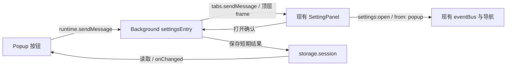
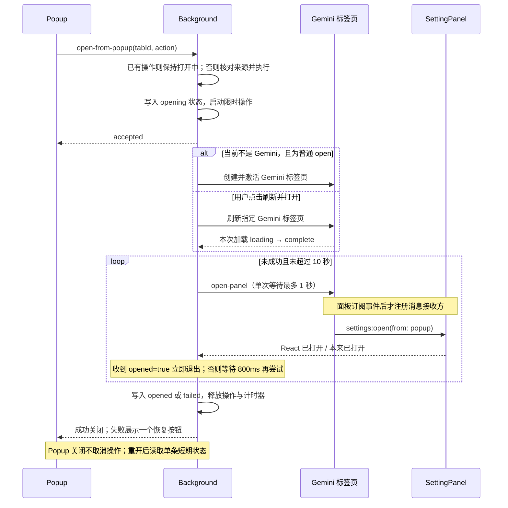

# Popup 设置入口：产品与技术方案

状态：已实现并通过自动验证，Chrome/Firefox 实页验收待完成。关联 [Issue #39](https://github.com/RonkTsang/gemini-chat-extension/issues/39)。

## 1. 目标与范围

在浏览器扩展 Popup 中提供「打开完整设置」，打开 Gemini 页面里已有的 `SettingPanel`，摆脱 SideNav 私有 DOM 对入口的影响。侧栏与快捷键继续作为便捷入口。

本期包含按钮、跨标签页打开、限时等待和失败恢复。复用现有设置布局、导航和事件，不新增独立设置页、悬浮入口、通用消息框架或持久任务队列。

稳定性边界：入口不依赖 Gemini 侧栏结构，但设置面板仍需要 Gemini 内容脚本正常运行。加载超时、网站访问权限被关闭、扩展更新使旧脚本失效时，统一提供失败反馈与恢复操作，不推断登录状态。

## 2. 产品规则

普通 Popup 顶部增加主按钮，保留现有快捷开关。通知权限授权专用界面保持原有流程。

| 场景 | 行为 |
| --- | --- |
| 当前为 Gemini，面板就绪 | 当前页打开设置，成功后关闭 Popup |
| 当前为 Gemini，仍在加载 | 按钮显示「正在打开…」，限时等待 |
| 当前不是 Gemini | 新建并激活 `https://gemini.google.com/app`，加载后自动打开设置 |
| 已有多个 Gemini 标签页 | 当前为 Gemini 时只操作当前页；否则新建，不搜索或切换其他账号的页面 |
| 面板已经打开 | 保持当前设置页和编辑内容，不执行关闭或重置导航 |
| 面板尚未打开 | 进入 `enhancements`，与侧栏入口一致 |
| SideNav 入口消失或侧栏收起 | 不影响 Popup 打开链路 |
| 操作中关闭 Popup | 后台继续执行；再次打开 Popup 可读取短期结果 |
| 操作期间再次点击 | 主按钮禁用，保持「正在打开…」，不新建目标、不排队 |
| 目标关闭或离开 Gemini | 结束操作，不另开标签页、不继续发送消息 |

Popup 只展示待操作、打开中、失败三种状态，并始终只显示一个主按钮。成功确认后关闭 Popup，不展示成功文案。

| 状态 | 主按钮与反馈 |
| --- | --- |
| 待操作 | 「打开完整设置」；无辅助提示 |
| 打开中 | 「正在打开…」；禁用主按钮，无额外忙碌提示 |
| 失败 | 提示「未能打开设置」；主按钮根据目标页面状态显示「刷新并打开」或「重新打开」 |

失败原因仅用于后台判断与排查，不逐项转为用户提示。失败时仍只有一个主按钮，不让用户在恢复按钮之间做选择：

- 原 Gemini 标签页仍存在于当前窗口且仍是 Gemini 页面时，主按钮显示「刷新并打开」。点击后刷新该页面并打开设置。
- 原标签页已关闭、已离开 Gemini、目标不可用或没有目标时，主按钮显示「重新打开」。点击后复用可用的 Gemini 页面，否则创建 Gemini 页面并打开设置。

「刷新并打开」只在用户明确点击后刷新原 Gemini 标签页；先监听该标签页本次 `loading → complete`，再执行现有打开重试，避免接受旧页面回复。等待加载与消息重试共用 10 秒期限，结束时清理监听。

「重新打开」由后台选择页面：仍可用的原 Gemini 标签页优先复用，URL 不可见时仍尝试已知目标；否则按正常入口使用当前 Gemini 页面或新建 Gemini 标签页。无需用户判断页面是否可用，不自动刷新聊天页面。

失败结果仅在当前标签页与操作的来源页或目标页一致时展示。换到无关页面后恢复正常入口；全扩展已有操作进行中时，统一显示禁用的「正在打开…」。

## 3. 文件目录与复用

```text
docs/feature/setting_panel/
  popup-entry-prd-tech.md                  本方案
src/entrypoints/popup/
  App.tsx                                 接入按钮；保留授权专用界面
  OpenSettingsButton.tsx                   新增：单按钮、加载、统一失败反馈
src/entrypoints/background/
  index.ts                                注册设置打开消息处理
  settingsEntry.ts                        新增：选定目标、限时尝试、结束清理
src/services/
  settingsEntryStatus.ts                   新增：短期状态读写与过期检查
src/components/setting-panel/
  index.tsx                               接收打开消息，复用事件并确认打开
src/entrypoints/content/
  index.tsx                               保持现有 overlay 挂载时序
src/types/runtime-messages.ts              补充消息、响应与状态类型
wxt.config.ts                             补充 activeTab（如当前权限不足）
```

| 已有建设 | 使用方式 |
| --- | --- |
| `SettingPanel`、`Sidebar`、`ContentArea` | 原样复用设置容器和页面 |
| `utils/eventbus.ts`、`hooks/useEventBus.ts` | 继续走 `settings:open`，来源为已有的 `popup` |
| `stores/settingStore.ts` | 复用 `setActiveSection`，只在面板关闭时选择默认模块 |
| `utils/async.ts` | 使用 `sleep` 完成短暂重试间隔 |
| `types/runtime-messages.ts` | 沿用消息常量、类型及输入检查的组织方式 |
| `responseCompleteNotification/contentClient.ts` | 参考单次消息超时写法，不调用通知业务或抽取通用客户端 |
| `responseCompleteNotificationPermissionIntent.ts` | 参考 session 状态读写与 TTL 检查，不复用通知权限数据 |
| Chakra `Button`、`Text` 和 `utils/i18n.ts` | 按钮局部加载与提示，避免整个 Popup 闪烁 |

业务辅助函数保留在上述模块中；不为了两类消息再拆 router、manager、repository。实现时的 locale 修改按项目要求交给 `i18n-writer`。

## 4. 架构与消息



只增加两类运行时消息：

```ts
// Popup -> Background; capture tabId on click, validate its window and URL.
type OpenFromPopup = {
  type: 'settings:open-from-popup'
  tabId: number
  action: 'open' | 'retry' | 'reload'
}
// Background -> Gemini top frame; ignore expired requests on receipt.
type OpenPanel = { type: 'settings:open-panel'; expiresAt: number }

// The first message acknowledges acceptance, not completion.
type StartResult = { accepted: true } | { accepted: false; error: string }
// Confirm after React opens the panel, or immediately if already open.
type PanelResult = { opened: boolean }
```

未知消息不回复，避免干扰其他监听器。按现有 `wxt/browser` 使用方式处理异步响应；接收方校验消息和扩展来源。页面消息指定 `frameId: 0`，不广播到 iframe。

**成功判定：**Background 在本次尝试的等待期限内，收到目标顶层 `SettingPanel` 的 `{ opened: true }` 才判定成功。面板本来已打开时直接回复；否则触发已有打开事件，在 React 提交 `open=true` 的 effect 中回复。无需等待展开动画或各设置页的数据加载。`accepted: true` 只代表后台受理；`sendMessage` 未报错、事件已发出、空响应或 `{ opened: false }` 均不代表打开成功。

## 5. 逻辑时序



**时限与生命周期：**总时限 10 秒，首次立即尝试；每次未成功的尝试结束后等待 800ms，再发下一次消息，不并行发送。单次消息等待不超过剩余时限且最多 1 秒。目标检查和其他异步步骤同样受总期限约束。超时即失败，不在用户登录完成或很久以后突然弹出设置。

全扩展同时只执行一个打开操作。Background 用一个 `inFlight` 标记防止重复启动，成功、失败、超时或目标消失时清理。窗口 ID 仅用于把新标签页创建在来源窗口，不作为任务或状态的分组维度。Popup 卸载只移除自己的状态监听。

全扩展只保存一条最近操作的短期状态：

```ts
type EntryStatus = {
  sourceTabId: number
  targetTabId?: number
  phase: 'opening' | 'opened' | 'failed'
  error?: 'timeout' | 'target-closed' | 'target-left' | 'start-failed'
  expiresAt: number
}
// session key: settingsEntryStatus
```

`opening` 在总期限后失效；结束结果保留 60 秒，过期读取时删除，新操作覆盖旧结果。Background 意外终止后不恢复任务，失效的 loading 不阻止重新点击。

Popup 重开时仅展示未结束进度或失败反馈，忽略旧的 `opened` 记录，不显示成功提示，也不因旧成功记录立即关闭；仅观察到本次操作新产生的成功结果时关闭。

## 6. 核心伪代码

以下表达业务顺序，省略类型检查、计时器清理和标准错误转换；辅助函数均为功能模块内部函数。

```ts
// OpenSettingsButton: keep loading local to this button.
async function onClick(action = 'open') {
  const source = await getActiveTabInPopupWindow()
  // The main button selects one recovery action; background resolves the tab.
  const tabId = action === 'reload' ? visibleStatus.targetTabId : source.id
  const result = await browser.runtime.sendMessage({
    type: 'settings:open-from-popup', tabId, action,
  })
  if (!result.accepted) {
    if (result.error === 'busy') showExistingOpeningStatus()
    else showGenericFailure()
  }
  // Watch progress; close only when the observed operation newly succeeds.
}

// settingsEntry: one temporary operation for the entire extension.
async function start(message) {
  if (inFlight) return { accepted: false, error: 'busy' }
  const deadline = Date.now() + 10_000
  reserveOperation(deadline) // Set inFlight before the first await.
  try {
    const source = await browser.tabs.get(message.tabId)
    // Check the active source and previous failure before retry/reload.
    const target = await resolveTarget(source, message.action, deadline)
    await writeStatus(openingStatus(source, deadline))
    void run(target, message.action, deadline).catch(handleUnexpectedFailure)
    return { accepted: true } // Execution is independent of the Popup channel.
  } catch (error) {
    releaseOperation()
    return { accepted: false, error: 'start-failed' }
  }
}

async function run(target, action, deadline) {
  try {
    if (target.needsGeminiTab) {
      target = await createActiveGeminiTab(target.windowId)
    }
    await updateTarget(target.id)
    if (action === 'reload') {
      await reloadAndWaitForLoadingComplete(target.id, deadline)
    }
    while (Date.now() < deadline) {
      // Stop on removal/departure; allow Gemini navigation still loading.
      await verifyTarget(target.id, deadline)
      const reply = await tryOpenPanel(target.id, deadline) // frameId: 0
      if (reply?.opened === true && Date.now() < deadline) {
        return await finish('opened')
      }
      await sleep(Math.min(800, Math.max(0, deadline - Date.now())))
    }
    await finish('failed', 'timeout')
  } catch (error) {
    await finish('failed', classifyError(error))
  } finally {
    releaseOperation() // Clear inFlight and this operation's timers.
  }
}

// SettingPanel: register after the existing settings:open subscription.
function onOpenPanel(message, sender, sendResponse) {
  if (!isOwnOpenPanelMessage(message, sender)) return
  if (Date.now() >= message.expiresAt) return sendResponse({ opened: false })
  if (openRef.current) return sendResponse({ opened: true })
  // One expiring reply slot; settle the previous reply on replacement/unmount.
  rememberReplyUntilCommit(sendResponse, message.expiresAt)
  eventBus.emitSync('settings:open', {
    from: 'popup', open: true, module: 'enhancements',
  })
  return true
}
// Reply from the open=true effect, not immediately after emitSync.
```

`resolveTarget` 和刷新等待均为 `settingsEntry.ts` 内部逻辑，不抽取通用框架。`tryOpenPanel` 参考现有通知消息超时实现，用局部 timer 与 `Promise.race`；无接收方、单次超时视为可重试，发送成功但响应无效不算成功。发送时携带本次总期限 `expiresAt`，页面端忽略过期请求；晚到回复不延长期限，也不覆盖已结束的结果。不得通过 SideNav selector 判断就绪。

## 7. 初始化与权限

`content/index.tsx` 保持原有启动时序：两次主世界脚本注入完成，并启动既有服务后，再挂载 overlay。保留一个 React root，不提前运行 overlay 内的副作用。Popup 通过后台限时重试等待 SettingPanel 挂载；前置初始化超过 10 秒、失败或卡住时，本次打开操作结束并提供恢复操作，不绕过初始化依赖打开设置。

保留原有 overlay 挂载与 context 失效处理，不新增 signal 接线、React root 卸载或 pagehide 清理。消息接收注册与 `SettingPanel` 生命周期绑定；React StrictMode 重挂载、组件卸载时移除监听并结束待回复；待回复同时受请求期限约束。旧内容脚本失效或面板挂载失败时，由后台限时等待结束并提供恢复操作。

已确定目标 tabId 后，即使 `tabs.get` 的 URL 字段因权限不可见，也继续尝试发送打开消息；仅在 URL 可见且确定离开 Gemini 时结束操作。URL 可见性不作为内容脚本就绪条件，成功仍须收到 `{ opened: true }`。

Chrome 和 Firefox 共用 `wxt/browser` 链路。读取当前标签页 URL 所需权限优先采用 `activeTab`，不新增 `tabs`、`scripting` 或全部网站权限，不主动注入第二份内容脚本。修改 `wxt.config.ts`，检查两个生成 manifest；保留现有 Gemini 内容脚本匹配范围和通知授权逻辑。

参考：[消息通信](https://developer.chrome.com/docs/extensions/develop/concepts/messaging)、[activeTab](https://developer.chrome.com/docs/extensions/develop/concepts/activeTab)、[MV3 生命周期](https://developer.chrome.com/docs/extensions/develop/concepts/service-workers/lifecycle)。本流程只有短期操作，不承诺浏览器重启或扩展重新加载后的自动恢复。

## 8. 验收

实现后运行类型检查、Chrome/Firefox 构建及 i18n 校验。针对后台覆盖限时等待、重复请求拦截、目标消失和状态过期；针对面板覆盖订阅后接收、打开确认、已打开时保留导航及监听清理。

加载本次构建后在 Chrome、Firefox 验证：

- 删除/隐藏 SideNav 入口，Popup 仍能打开现有面板。
- 当前 Gemini、非 Gemini 新建、慢加载三条路径正确。
- Popup 自动或手动关闭后，操作继续；失败结果重开可见。
- Popup 始终只有一个设置入口按钮；统一失败反馈，成功无提示；失败时可刷新则「刷新并打开」，否则「重新打开」。
- 包括换到其他窗口后再次点击在内，已有操作未结束时不启动第二个操作。
- 扩展更新后的旧页面能提示恢复；仅显式点击才刷新。
- 未登录、目标关闭/跳转、网站权限关闭时能够结束等待。
- 通知授权专用 Popup 与原有侧栏、快捷键保持正常。

## 9. 实现与验证记录

- 已接入普通 Popup 主按钮、后台限时打开、单操作拦截、session 短期状态、重试及显式刷新恢复。
- SettingPanel 在 React 提交打开状态后确认；已打开时保留当前导航。content 与 overlay 入口文件保持 Git 原代码，未新增 signal 接线或 pagehide 清理。
- 41 项后台、面板与 Popup 测试，覆盖超时、晚到回复、目标关闭/跳转与重新打开、隐藏 URL、刷新加载等待与清理、统一失败反馈及单按钮恢复、状态过期、StrictMode 清理、旧结果重开及 Popup 关闭后继续执行。
- 类型检查、Chrome/Firefox 构建、i18n 校验通过；两个生成 manifest 均包含 activeTab，Gemini 内容脚本匹配范围保持不变。
- Chrome/Firefox 本次构建的实页验收仍待完成，第 8 节场景不得仅凭自动测试视为通过。
